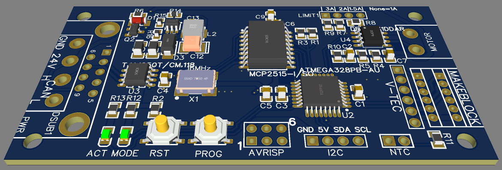

# MKDrive Hardware Version 1

## Components
* ATMEGA 328
* CAN: MCP2515 + TJA1050
* DRV8871

## Characteristics
* 6 .. 24 V
* 3.2 A
* CAN 2.0 (max. 1 Mbaud)

## Resources
* Board files: https://easyeda.com/mkaschub/can_dc_motor_copy
